# Shelvd

A cross-platform mobile app for book collectors to build and manage a personal digital library. Scan a barcode or enter an ISBN, and Shelved automatically pulls in the cover, title, and author from the Google Books API. Organize your collection with a flexible tagging system that acts as virtual shelves.

Built with **Kotlin Multiplatform** and **Compose Multiplatform**, targeting both Android and iOS from a single shared codebase.

> **Status:** Work in progress — core flows are functional end-to-end on Android and iOS. Shipped: email/password auth, library grid (tag filter, sort, search), barcode scanning (ML Kit / AVFoundation), Add Book by ISBN or title, Book Detail with tag toggling, Tag Management, Manual Entry, and tablet two-pane layout.

## Screenshots

### iOS (Light Mode)

| Library | Tags | Manage Tags | Add Book |
|---------|------|-------------|----------|
| 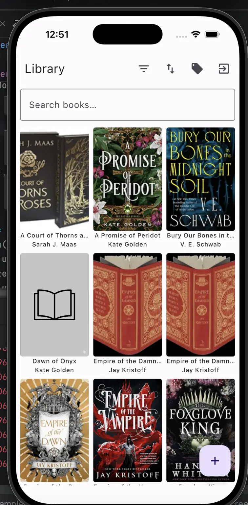 | 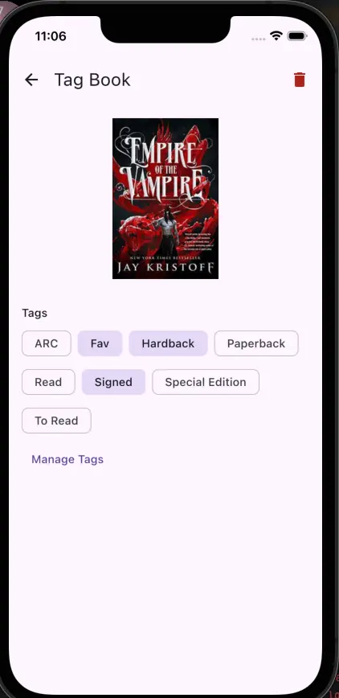 | 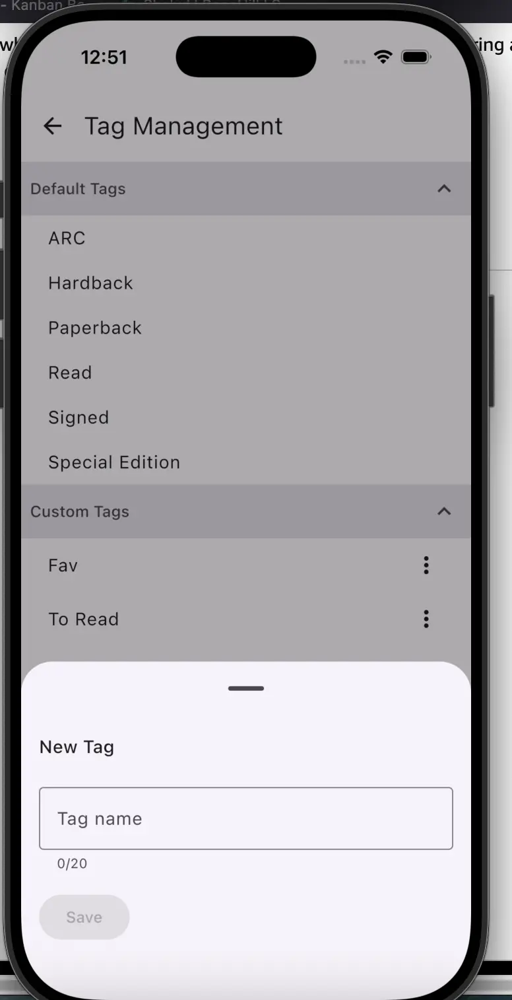 | 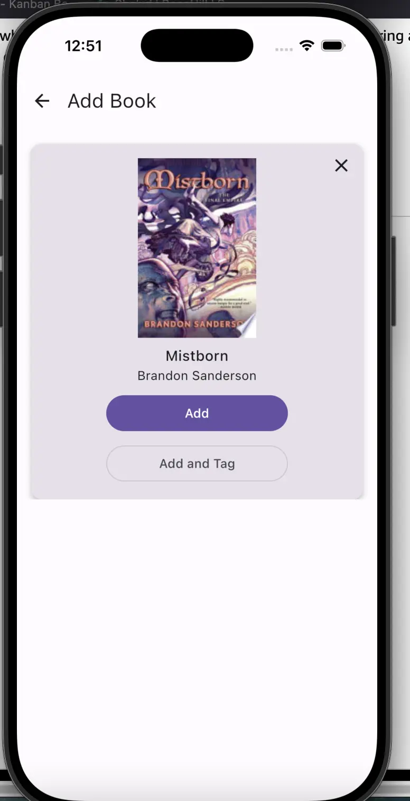 |

### Android (Dark Mode)

| Library | Tags | Title Search | Add Book |
|---------|------|--------------|----------|
| 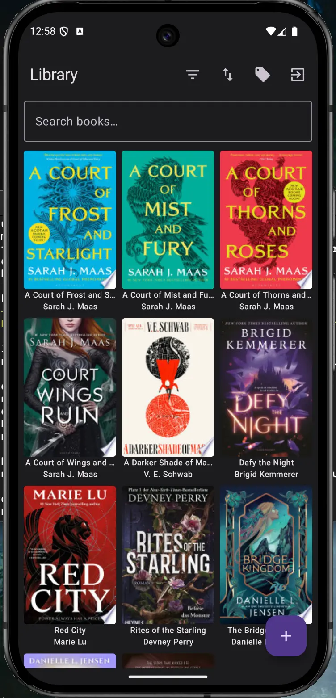 | 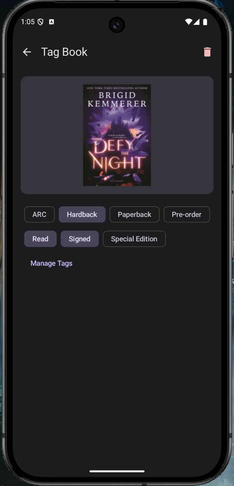 | 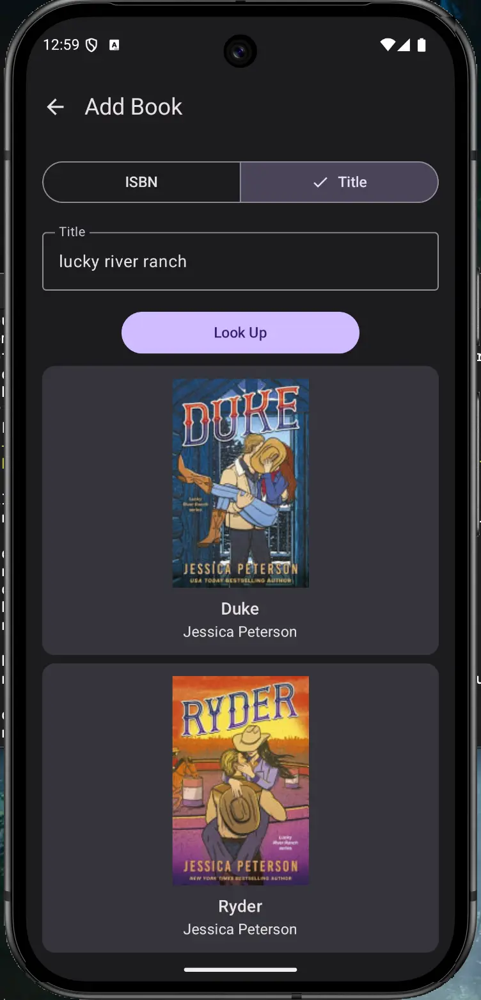 | 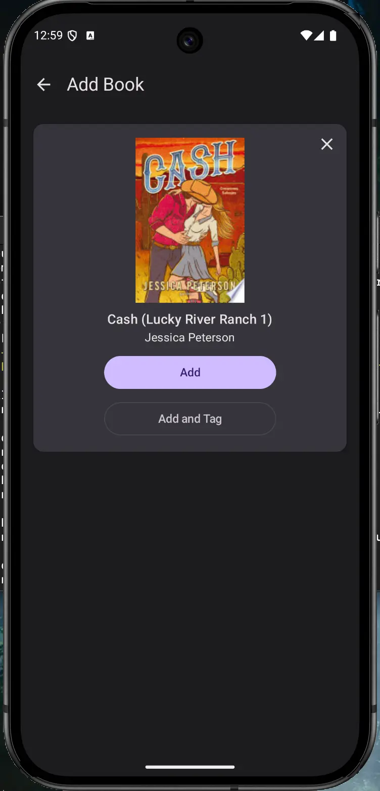 |

### Tablet (Two-Pane Layout)

| Android Library | Android Add Book | iOS Library | iOS Add Book |
|-----------------|------------------|-------------|--------------|
| 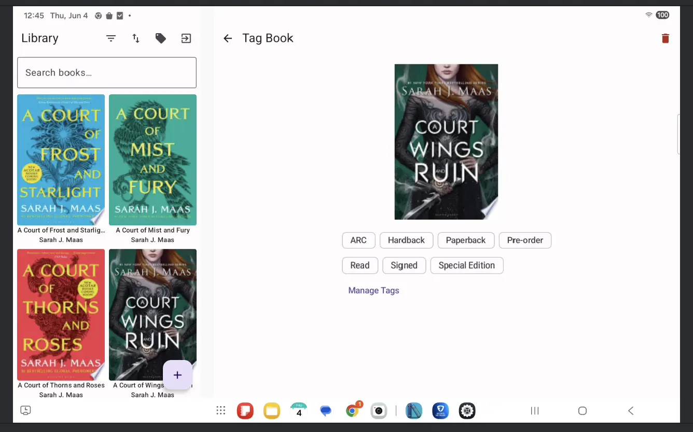 | 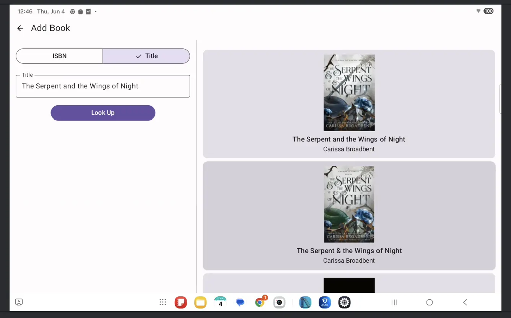 | 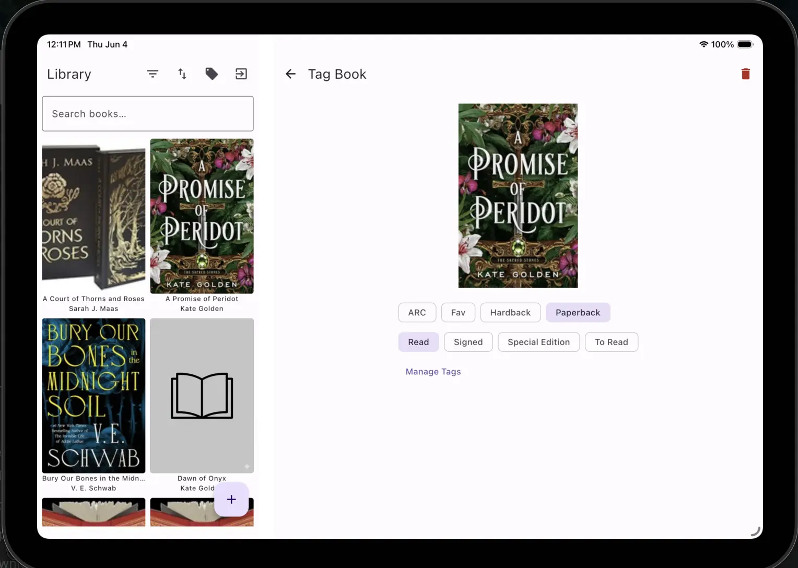 | 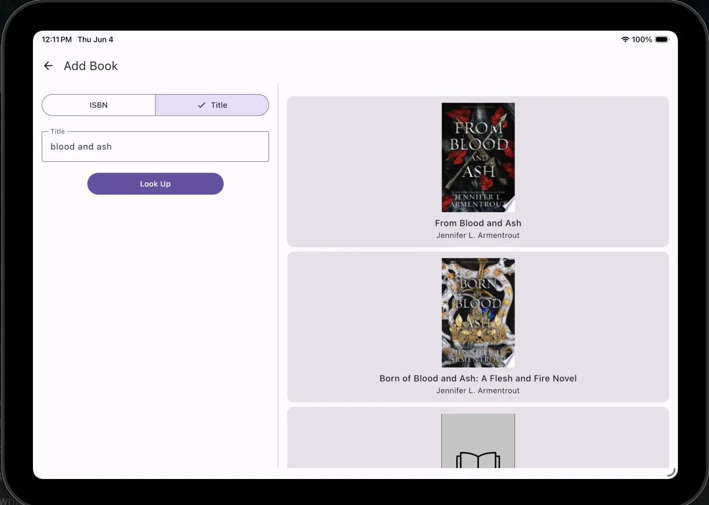 |

## Tech Stack

| Layer | Technology |
|-------|-----------|
| Shared Logic | Kotlin Multiplatform (KMP) |
| Shared UI | Compose Multiplatform |
| Backend & Auth | Supabase (Auth, PostgreSQL, Row Level Security) |
| Networking | Ktor Client |
| Serialization | kotlinx.serialization |
| Image Loading | Coil 3 (Multiplatform) |
| Dependency Injection | Koin |
| Navigation | Compose Navigation (Multiplatform) |
| Barcode Scanning | ML Kit (Android) / AVFoundation (iOS) |

## Architecture

Shelved follows a **clean architecture** pattern with clear separation between layers:

- **Presentation** (`composeApp/commonMain`) — Compose screens, ViewModels exposing state via `StateFlow`
- **Domain** (`shared/commonMain`) — Use cases, domain models, and repository interfaces. Pure Kotlin, no platform dependencies
- **Data** (`shared/commonMain` + platform source sets) — Repository implementations, Supabase data sources, Google Books API client

Platform-specific code (barcode scanning) uses KMP's `expect`/`actual` pattern to keep the shared API clean while leveraging native capabilities on each platform.

## Development Workflow

This project uses [Claude Code](https://github.com/anthropics/claude-code) as part of the development workflow. The repo includes a `CLAUDE.md` project context file and custom commands in `.claude/commands/`.

## Build & Run

**Prerequisites:** Android Studio (with KMP plugin), Xcode, and a JDK compatible with the project's Kotlin version. Copy `local.properties.example` to `local.properties` and fill in your Supabase URL and anon key before building — the app will not compile without them.

**Android:** Use the run configuration in Android Studio (select the `productionDebug` build variant), or `./gradlew :composeApp:assembleProductionDebug` from the terminal.

**iOS:** Open the `/iosApp` directory in Xcode and run from there.

**Staging builds:** See [docs/staging.md](docs/staging.md) for how to configure and run the staging environment on Android and iOS.
